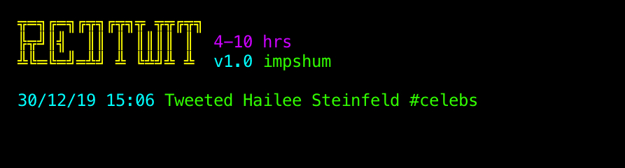

## RedTwit

Tweets images/gifs from chosen subreddits

### Instructions

-   Install requirements `pip install -r requirements.txt`
-   Create Reddit (script) app at https://www.reddit.com/prefs/apps/ and get keys
-   Create Twitter app at https://apps.twitter.com/ and get your keys
-   Get your Gfycat keys from https://developers.gfycat.com/signup/#/apiform
-   Edit conf.ini with your details
-   Run it `python run.py`

#### Settings Info

-   `target_subreddits` - Separated by commas (no spaces)
-   `min_sleep` - Minimum hours to sleep between tweeting
-   `max_sleep` - Maximum hours to sleep between tweeting
-   `hashtags` - Adds the title of the subreddit as a hashtag
-   `allow_nsfw` - Allow over 18 submissions
-   `test_mode` - Run the script without tweeting

### Notes

This script does not work with Giphy yet as it's not needed at this time. If you require this functionality feel free to contact me.

---

BTC - 1AYSiE7mhR9XshtS4mU2rRoAGxN8wSo4tK
